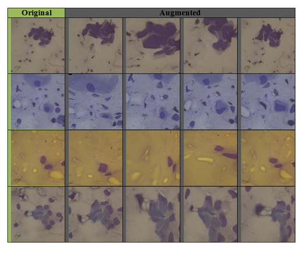
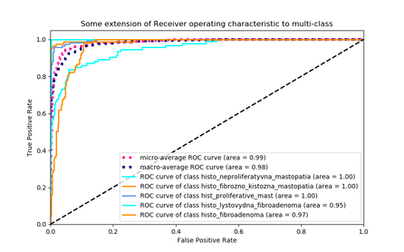

# Purpose of the software

I present Rudi, a Python tool that simplifies the dataset preparation for training a convolutional neural network or other things that need images as input data. The tool contains a set of practical generalized tools, which can wrap common operations like image resizing, flipping, zooming, distortion and others. Presented tool can be helpful with extending the dateset when the user does not have enough of data.

# Background

Creating a train and test dataset of images of adequate size is a very 
non-trivial task. And this is not about the technical difficulties of collecting 
and storing a million images, but about the perennial situation when you 
have one and a half pictures in the first stage of system development. 
In addition, it should be understood that the composition of the training set 
can affect the quality of the resulting recognition system more than all other factors.

Deep artificial neural networks require a large corpus of training data in order to 
effectively learn, where collection of such training data is often expensive and laborious. 
Data augmentation overcomes this issue by artificially inflating the training
set with label preserving transformations. Recently there has been extensive use 
of generic data augmentation to improve Convolutional Neural Network (CNN) task performance [@taylor2017; @connor2019].

Data augmentation is a technique to artificially create new training data from existing training data. 
This is done by applying domain-specific techniques to examples from the training data that create new 
and different training examples. Image data augmentation is perhaps the most well-known type of data 
augmentation and involves creating transformed versions of images in the training dataset that 
belong to the same class as the original image.

To create a larger base of training samples, data augmentation techniques are found effective 
to enlarge the training datasets and lead to better performance. Traditional data 
augmentation techniques include traditional transformation measures such as image 
flipping and rotations, random cropping, random scaling, center zooming, 
brightness and sharpness adjusting and noise mixing [@micha2018]. 

# Summary

Modern deep learning algorithms, such as the convolutional neural network (*CNN*), is able to 
learn features that are invariant to their location in the image. Nevertheless, augmentation 
can further aid in this transform invariant approach to learning and can aid the model in learning 
features that are also invariant to transforms such as flipping, rotating, 
light levels in photographs, contrast and much more. Image data augmentation is typically only applied 
to the training dataset, and not to the validation or test dataset [@mlmastery2019].

Also, for training a neural network that accepts images as input data it needs 
to convert images in dataset to the same aspect ratio, extension, etc. Rudi will 
take care of it for a user. *Rudi* is a command line tool for dataset augmentation and transformation.

The software Rudi is built upon precursor algorithms and software for image operations 
and data augmentation. [^1] [^2]

Rudi is implemented in Python. It takes as input a root directory of dataset images and a few additional 
options and outputs converted images to *output* directory in a root. 

Rudi tool provides two main commands:

+ `rudi convert`
+ `rudi augment`

The first is to convert the dataset of images, with its typical interface, 
which converts data to specific format (*file extension* `jpg|png`) and size defined by a user. 
The second is to augment the entire dataset with operations, such as flipping, 
rotating, zooming, random distortion and skewing.

[^1]: <https://github.com/python-pillow/Pillow>

[^2]: <https://github.com/mdbloice/Augmentor>

# Examples

After installation `Rudi`, the tool can be called by typing `rudi` in the terminal window (see Figure 1).

This tool was used for expanding the dataset of biomedical images [@tneufcit2019] from under 100 to more than 500 images (see Figure 2).

As described by @tneufcit2019 this approach allowed author to achieve an accuracy of *95%* on *dataset of histological images* (5 classes) (see Figure 3).

# References
